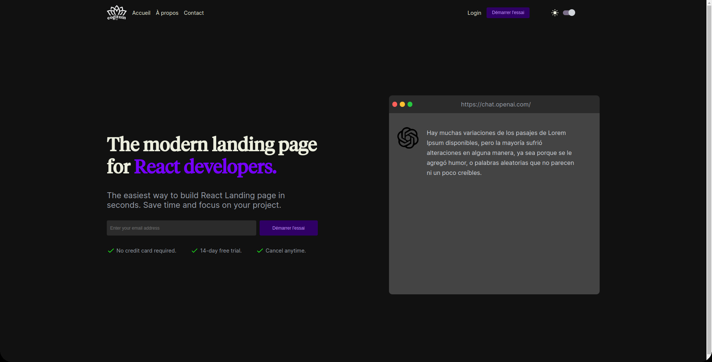
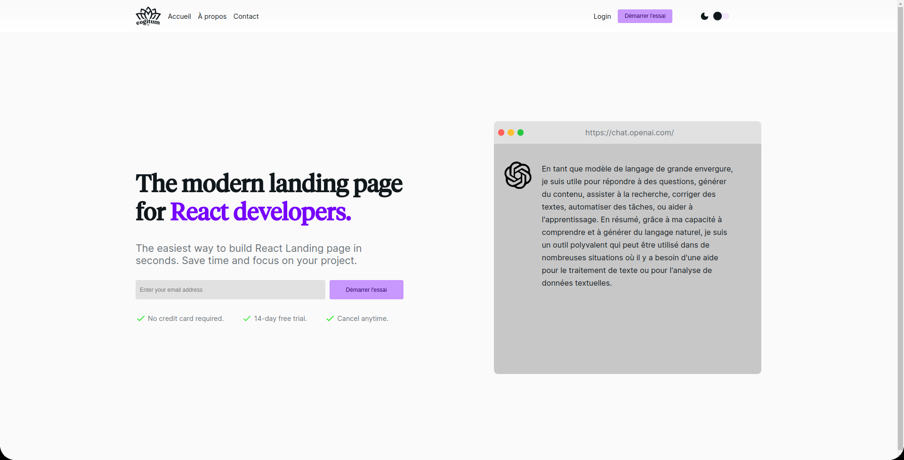

# ReactJS SAAS Landing Page

This project is built with React.js and SASS.

# Dark Mode

# Light Mode

## Installation
This project is built with React.js and SASS.

`npm install`

## Running the Project

To run the project, run the following command:

`npm start`

The project will be accessible at `http://localhost:3000` in your browser.

## Modifying Styles

To modify styles, you can use SASS. To automatically compile SASS files into CSS, run the following command:

`sass --watch src/style/index.scss src/style/style.css`

## Dockerization

To dockerize the project, run the following command:

`docker build -t $name .`

Replace `$name` with the name of your Docker image.

## License

This project is licensed under the MIT License. See the `LICENSE` file for details.
